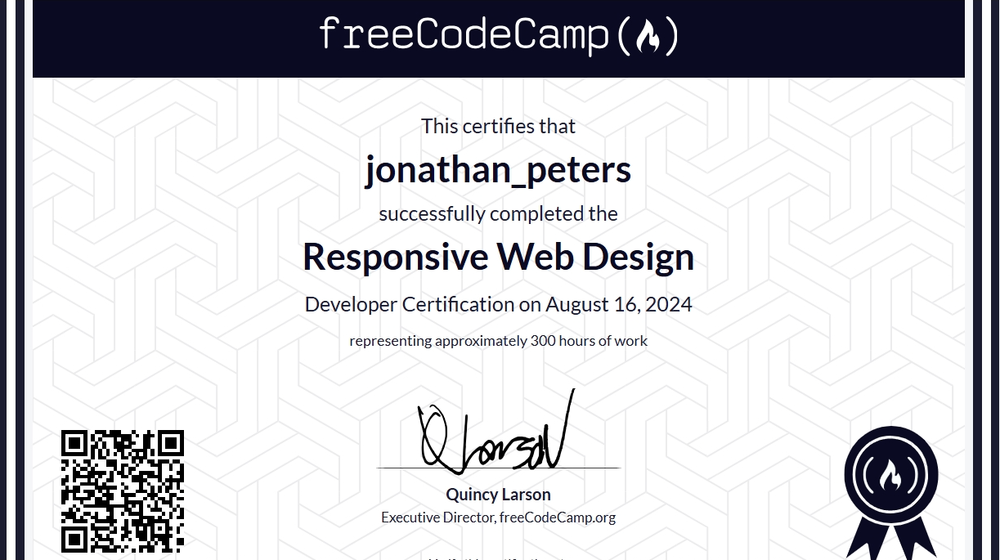
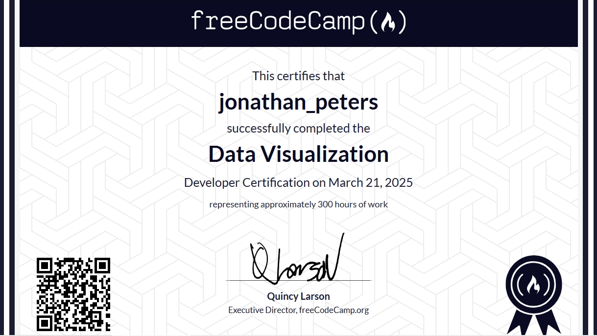
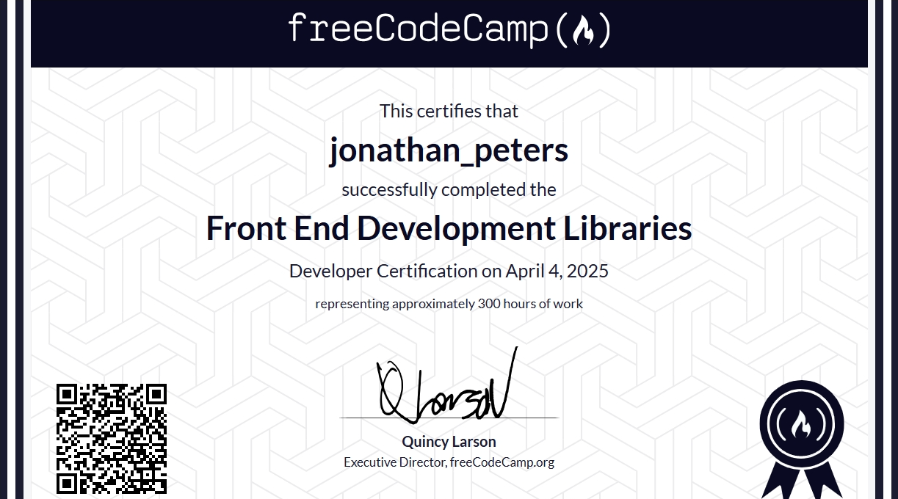
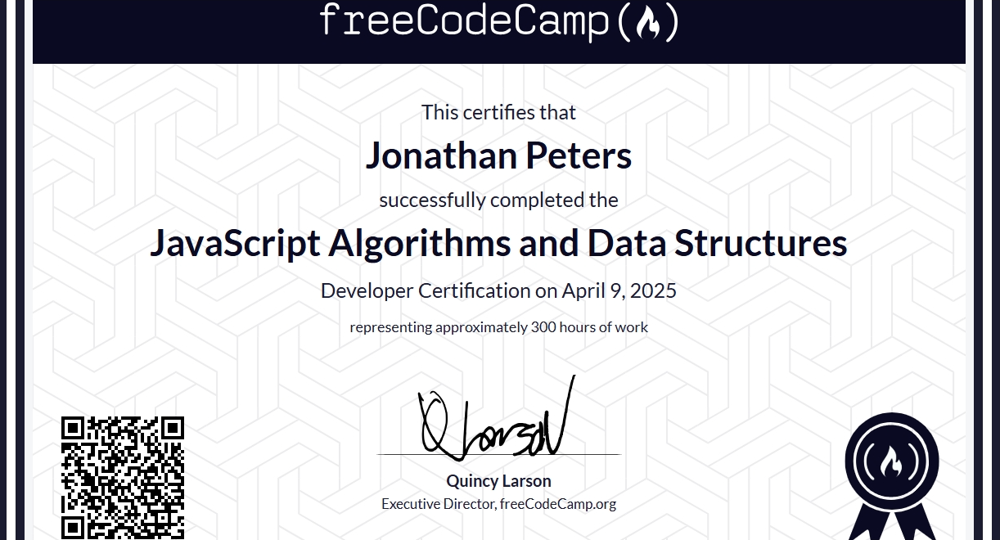

## Hi there 👋 I'm [Jonathan](https://qms85.github.io/MyPortfolio/) 
## Welcome to my Github profile

I am a self-taught Front-End Web Developer.
I have completed HTML, CSS & JavaScript online courses offered by [Bitdegree](https://www.bitdegree.org/courses/), as well as [Responsive Web Design](https://www.freecodecamp.org/learn/2022/responsive-web-design/), [Data Visualization](https://www.freecodecamp.org/learn/data-visualization),  [Front-End Development Libraries](https://www.freecodecamp.org/learn/front-end-development-libraries) & [JavaScript Algorithms & Data Structures](https://www.freecodecamp.org/learn/javascript-algorithms-and-data-structures-v8/) offered by [freeCodecamp](https://www.freecodecamp.org/learn/).

In my spare time I'm busy completing online courses offered by [Bitdegree](https://www.bitdegree.org/), [Codecademy](https://www.codecademy.com/), [Educative](https://www.educative.io/), [freeCodeCamp](https://www.freecodecamp.org) & others, completing projects & challenges, writing some articles etc.
I would still love to learn other languages such as Express & Node JS, other Javascript frameworks/libraries, python Etc Etc and start a trip into back-end development, as well as blockchain development...   

There are so many programming languages 😲😲...:  
Where do i start???🤔🤔🤔

Apart from coding, I'm also a house music DJ/Producer & label owner @ [Digital Divide Records](https://digitaldividerecords-pty-ltd.github.io/DigitalDivideRecords/).  
The releases are available on [Beatport](https://www.beatport.com/label/digital-divide-records/100802),  
[Juno Download](https://www.junodownload.com/labels/Digital+Divide/) & all major download & streaming platforms.  
I enjoy listening to music, or creating house music, watching movies/series & reading when i have time available.

My Completed Courses Offered By freeCodeCamp:

My Completed Courses Offered By Bitdegree:

## Connect with me

  
  
  

## Tech Stack

  
  
<a href="https://developer.mozilla.org/en-US/docs/Web/CSS" target="_blank">
  <a href="#">
  
  
  
  

## Tools

  
  
  
  <a href="https://github.com/" target="_blank">

  
  
  
  
  

