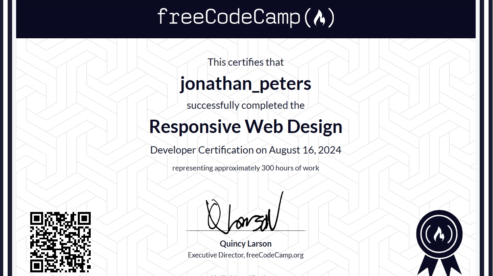
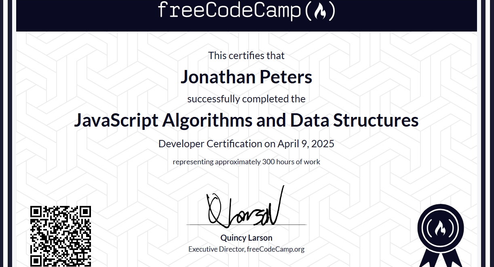

# Hi there 👋 I'm [Jonathan](https://qms85.github.io/MyPortfolio/)  
## Welcome to My GitHub Profile

---

### 🚀 About Me

I'm a **self-taught Front-End Web Developer** with a passion for building beautiful, responsive web applications and continuously expanding my skill set. My coding journey is fueled by curiosity, creativity, and a desire to solve real-world problems with technology.

- 🌱 Currently learning: Advanced JavaScript, React, Node.js, Express, Python, and exploring backend and blockchain development.
- 🎧 When I'm not coding, I'm a house music DJ/Producer and the label owner at [Digital Divide Records](https://digitaldividerecords-pty-ltd.github.io/DigitalDivideRecords/).
- 📚 Lifelong learner: I regularly complete courses on [Bitdegree](https://www.bitdegree.org/), [Codecademy](https://www.codecademy.com/), [Educative](https://www.educative.io/), and [freeCodeCamp](https://www.freecodecamp.org/).

---

### 🏆 Certifications & Courses

#### freeCodeCamp

#### BitDegree

---

### 🛠️ Tech Stack

---

### 🧰 Tools

---

### 📈 GitHub Stats

  
  
  
  
  
   
  

---

### 🤝 Connect with Me

---

### 💡 Fun Facts

- 👨‍💻 I enjoy working on both creative and logical aspects of web development.
- 🎵 Music is my second passion—I produce & DJ house music, and run a digital record label.
- 🧩 I love tackling new coding challenges and learning emerging web technologies.

---

## 📝 Let's Collaborate!

I'm always open to new projects, learning opportunities, and collaboration—feel free to connect with me!

---
